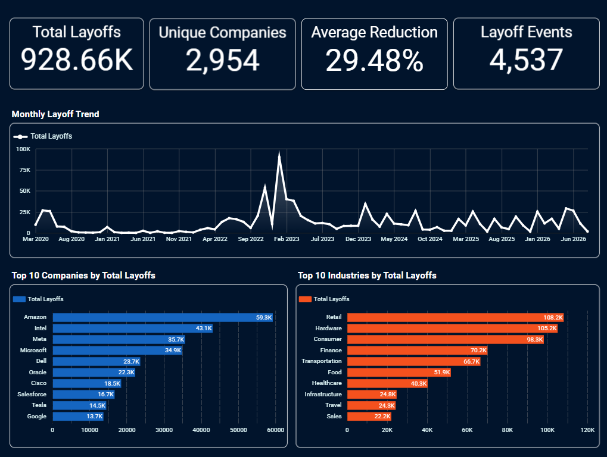
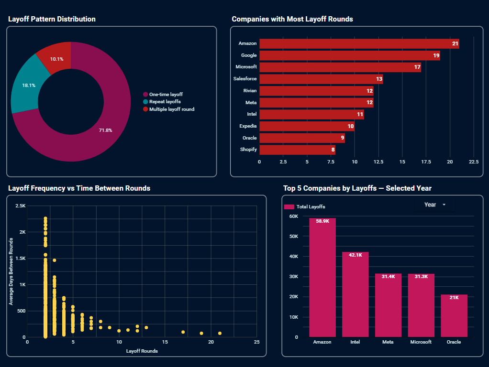
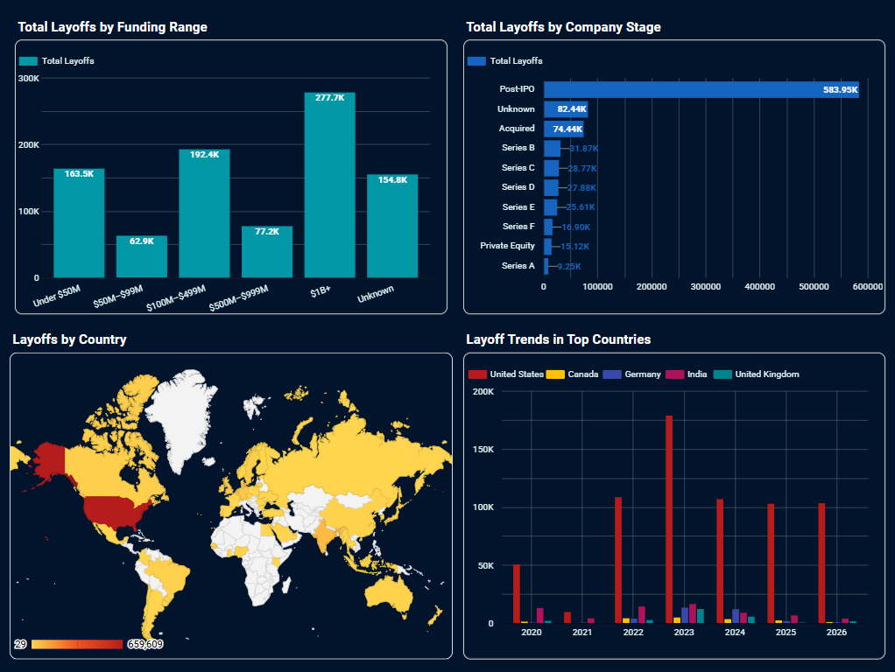

# Global Layoffs Workforce Reduction Analysis (2020–2026)

## Project Overview

This project analyzes **global layoff activity from 2020 to 2026** using **Google Sheets, BigQuery, SQL, and Google Data Studio**.

The analysis focuses on overall layoff trends, company-level impact, industry patterns, country-level differences, company stage, funding ranges, and repeated rounds of layoffs. The project follows an end-to-end analytics workflow: the raw dataset is audited in Google Sheets, cleaned and transformed in BigQuery, analyzed with SQL, and presented through an interactive Google Data Studio dashboard.

The objective is to turn a global layoffs dataset into a clear view of **when layoffs occurred, where they were concentrated, which companies and industries were most affected, and how often companies returned to layoffs across multiple rounds**.

---

## Business Questions

The analysis aims to answer the following questions:

* How many layoffs, companies, and layoff events are represented in the dataset?
* How did layoffs change from 2020 to 2026?
* What was the monthly pattern of layoffs over time?
* Which companies reported the highest total layoffs?
* What were the largest individual layoff events?
* Which companies experienced repeated rounds of layoffs?
* How much time typically passed between repeated layoff rounds?
* Which companies reported the most layoffs within each year?
* Which industries reported the highest total layoffs?
* Which countries experienced the greatest layoff activity?
* Which company stages reported the highest layoffs?
* How did layoffs vary across different funding ranges?

---

## Tools & Technologies

* **Google Sheets** — initial data audit, data dictionary, missing-value review, validation checks, and raw-data inspection
* **BigQuery** — cloud-based data cleaning, transformation, feature engineering, validation, and SQL analysis
* **SQL** — aggregations, CTEs, window functions, ranking, date analysis, segmentation, and reusable reporting views
* **Google Data Studio** — interactive dashboard development, geographic analysis, trend visualization, and analytical storytelling
* **GitHub** — project documentation, SQL versioning, audit files, and dashboard screenshots

---

## Project Workflow

### 1. Google Sheets Data Audit

The raw dataset was first reviewed in Google Sheets before being loaded into BigQuery.

The audit included:

* Dataset size and date coverage
* Missing values by field
* Numeric validation
* Layoff metric availability
* Date validation
* Distribution checks for layoff counts and percentages
* Funding validation
* Review of potential duplicates and text inconsistencies

The Google Sheets portion of the repository contains:

```text
google_sheets/
├── 01_raw_layoffs.csv
├── 02_data_dictionary.csv
├── 03_data_quality.csv
└── README.md
```

**[Google Sheets Audit](https://docs.google.com/spreadsheets/d/17h4zMD-OYyfoulOU6V9_QOqboz-XKiVVJC5RuyqHAHQ/edit?usp=sharing)**

---

### 2. BigQuery Data Profiling

The raw data was loaded into BigQuery and profiled to confirm the import and validate the main fields.

Key checks included:

* Row count
* Missing values
* Invalid numeric values
* Layoff metric availability
* Date anomalies
* Basic numeric distributions
* Raw-data preview

The raw dataset contained **4,562 records** covering layoffs from **March 2020 through August 2026**.

---

### 3. Data Cleaning

A cleaned BigQuery table was created using `CREATE OR REPLACE TABLE`.

Key cleaning steps included:

* Trimming text fields
* Standardizing confirmed company-name inconsistencies
* Standardizing country naming
* Removing confirmed duplicate layoff records
* Preserving legitimate null values rather than replacing them with zero
* Keeping records even when both layoff-count and layoff-percentage fields were unavailable

After deduplication, the cleaned dataset contained **4,560 records**.

---

### 4. Feature Engineering

An analysis-ready table was created in BigQuery with additional fields for reporting and analysis.

Key engineered fields include:

* `layoff_year`
* `layoff_quarter`
* `layoff_month`
* `year_month`
* `severity_category`
* `funding_range`
* `funding_order`

These fields support time analysis, workforce-reduction classification, and dashboard reporting.

---

### 5. Repeat Layoff Analysis

A major focus of the project is identifying companies that experienced layoffs across multiple rounds.

The analysis uses distinct combinations of:

```text
company + country + industry + date
```

to represent distinct layoff rounds and reduce the chance of counting multiple same-day records as separate rounds.

`LAG()` was used to identify the previous layoff date for each company grouping and calculate the average number of days between rounds.

The final patterns were classified as:

* **One-time layoff**
* **Repeat layoffs**
* **Multiple layoff rounds**

A reusable BigQuery view was created for dashboard reporting:

```sql
vw_repeat_layoff_summary
```

---

### 6. SQL Analysis

The SQL analysis was organized into separate files by analytical topic.

```text
bigquery/
├── 01_data_profiling.sql
├── 02_data_cleaning.sql
├── 03_feature_engineering.sql
├── 04_repeat_layoff_analysis.sql
├── 05_company_analysis.sql
├── 06_time_analysis.sql
├── 07_industry_analysis.sql
├── 08_country_analysis.sql
├── 09_stage_funding_analysis.sql
├── 10_repeat_layoff_view.sql
└── 11_top_companies_by_year_view.sql
```

The analysis uses:

* Aggregations
* `CASE`
* `CTE`
* `GROUP BY`
* Date functions
* `LAG()`
* `DENSE_RANK()`
* `COUNT(DISTINCT ...)`
* Window functions
* Conditional filtering
* Reusable BigQuery views

---

### 7. Google Data Studio Dashboard

The final report contains three dashboard pages.

#### Overview



This page summarizes:

* Total layoffs
* Unique companies
* Average workforce reduction
* Layoff events
* Monthly layoff trend
* Top 10 companies by total layoffs
* Top 10 industries by total layoffs

#### Company & Repeat Layoff Analysis



This page focuses on:

* Layoff pattern distribution
* Companies with the most layoff rounds
* Layoff frequency vs. average time between rounds
* Top 5 companies by layoffs for a selected year

#### Geography, Stage & Funding Analysis



This page focuses on:

* Geographic distribution of layoffs
* Total layoffs by company stage
* Total layoffs by funding range
* Layoff trends in top countries

**[Google Data Studio dashboard](https://datastudio.google.com/reporting/aa3d55b6-2d24-4325-a037-bfc61650f308)**

---

## Key Findings

### Global Layoffs Reached Nearly 929K

The dataset contains approximately **928.66K reported layoffs** across **4,537 distinct layoff events** and **2,954 unique companies**.

The average reported workforce reduction was approximately **29.48%**.

---

### Layoffs Peaked Around Early 2023

The monthly trend shows a sharp increase in layoffs during late 2022 and early 2023, with the largest monthly spike occurring around early 2023.

Layoff activity remained volatile afterward, with several smaller peaks continuing through 2024, 2025, and 2026.

---

### Amazon Reported the Highest Total Layoffs

Among companies in the dataset, the highest reported cumulative layoffs were:

* **Amazon — 59.3K**
* **Intel — 43.1K**
* **Meta — 35.7K**
* **Microsoft — 34.9K**
* **Dell — 23.7K**

This shows that the largest absolute workforce reductions were concentrated among several major technology and consumer-facing companies.

---

### Retail Was the Most Affected Industry

Among the displayed industry categories:

* **Retail — 108.2K layoffs**
* **Hardware — 105.2K**
* **Consumer — 98.3K**
* **Finance — 70.2K**
* **Transportation — 66.7K**

Retail therefore recorded the highest total layoffs among the named industries shown in the dashboard.

---

### Most Companies Appeared Only Once, but Repeat Layoffs Were Significant

The repeat-layoff analysis found:

* **71.8%** of company groupings had a one-time layoff
* **18.1%** experienced repeat layoffs
* **10.1%** experienced multiple layoff rounds

Although most companies appeared only once, more than one-quarter of the analyzed company groupings returned to layoffs at least once.

---

### Amazon and Google Recorded the Most Layoff Rounds

The companies with the highest number of distinct layoff rounds included:

* **Amazon — 21 rounds**
* **Google — 19**
* **Microsoft — 17**
* **Salesforce — 13**
* **Rivian — 12**
* **Meta — 12**

This highlights that repeated workforce reductions were not limited to isolated cases.

---

### Post-IPO Companies Accounted for the Largest Share of Layoffs by Stage

The **Post-IPO** category recorded approximately **583.95K layoffs**, far exceeding the other company-stage categories in the dataset.

This indicates that a large share of reported layoffs came from mature, publicly traded companies.

---

### $1B+ Funded Companies Reported the Highest Layoffs by Funding Range

Companies in the **$1B+ funding range** recorded approximately **277.7K layoffs**, the highest total among the funding groups used in the analysis.

The funding analysis is descriptive and should not be interpreted as evidence that higher funding caused layoffs.

---

### Layoffs Were Geographically Concentrated

The geographic dashboard shows that layoffs were heavily concentrated in a small number of countries, with the **United States** dominating both the geographic view and the year-by-year country trend.

This concentration reflects the strong representation of U.S.-based companies in the dataset.

---

## Main Insights

1. **Layoff activity was highly uneven over time.** The strongest concentration occurred around late 2022 and early 2023 rather than following a steady trend.

2. **Large companies account for a substantial share of reported layoffs.** Amazon, Intel, Meta, and Microsoft appear among the highest cumulative totals.

3. **Retail, Hardware, and Consumer industries experienced the largest absolute workforce reductions among the named industries.**

4. **Repeat layoffs are a meaningful part of the dataset.** More than one-quarter of analyzed company groupings experienced two or more distinct layoff rounds.

5. **Some companies returned to layoffs many times.** Amazon, Google, Microsoft, Salesforce, Rivian, and Meta stand out for repeated rounds.

6. **Post-IPO companies dominate layoffs by company stage**, suggesting that large mature firms account for a substantial portion of the reported workforce reductions.

7. **Layoffs are geographically concentrated**, with the United States representing the strongest country-level presence in the dataset.

8. **Funding level and layoffs show clear descriptive differences**, but the relationship should not be interpreted causally.

---

## Repository Structure

```text
global-layoffs-workforce-reduction-analysis/
│
├── README.md
│
├── bigquery/
│   ├── 01_data_profiling.sql
│   ├── 02_data_cleaning.sql
│   ├── 03_feature_engineering.sql
│   ├── 04_repeat_layoff_analysis.sql
│   ├── 05_company_analysis.sql
│   ├── 06_time_analysis.sql
│   ├── 07_industry_analysis.sql
│   ├── 08_country_analysis.sql
│   ├── 09_stage_funding_analysis.sql
│   ├── 10_repeat_layoff_view.sql
│   └── 11_top_companies_by_year_view.sql
│
├── data_studio/
│   ├── 01_overview.png
│   ├── 02_country_repeat_layoffs.png
│   ├── 03_geography_stage_funding.png
│   └── README.md
│
└── google_sheets/
    ├── 01_raw_layoffs.csv
    ├── 02_data_dictionary.csv
    ├── 03_data_quality.csv
    └── README.md
```

---

## Skills Demonstrated

### Google Sheets

* Raw-data auditing
* Data dictionary development
* Missing-value analysis
* Data validation
* Duplicate review
* Distribution checks
* Data-quality documentation

### BigQuery & SQL

* Cloud-based data preparation
* Data profiling
* Data cleaning
* Text standardization
* Deduplication with `ROW_NUMBER()`
* Common Table Expressions (CTEs)
* Aggregations
* Conditional logic
* Date analysis
* Window functions
* `LAG()`
* `DENSE_RANK()`
* Feature engineering
* Reusable SQL views

### Google Data Studio

* BigQuery data connection
* KPI scorecards
* Time-series visualization
* Company and industry ranking
* Geographic visualization
* Scatter-plot analysis
* Interactive filters
* Multi-page dashboard design
* Analytical storytelling

### Data Analytics

* Trend analysis
* Company-level analysis
* Industry analysis
* Geographic analysis
* Workforce-reduction analysis
* Repeat-event analysis
* Funding-stage analysis
* Data-quality assessment

---

## Conclusion

This project demonstrates an end-to-end cloud analytics workflow that transforms a raw global layoffs dataset into a structured and interactive analysis using **Google Sheets, BigQuery, SQL, and Google Data Studio**.

The analysis shows that layoffs were concentrated around major periods of workforce reduction, heavily influenced by large companies and specific industries, and frequently extended beyond one-time events. The repeat-layoff analysis adds a second layer to the project by showing which companies returned to layoffs multiple times and how those rounds were distributed over time.

The final dashboard brings together company, industry, geographic, stage, funding, and repeat-layoff findings in a concise three-page report.
